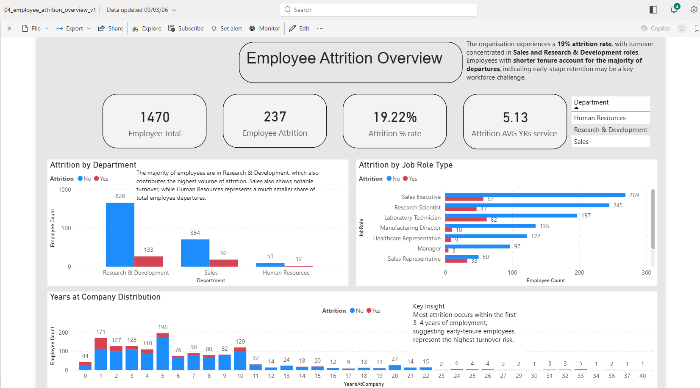
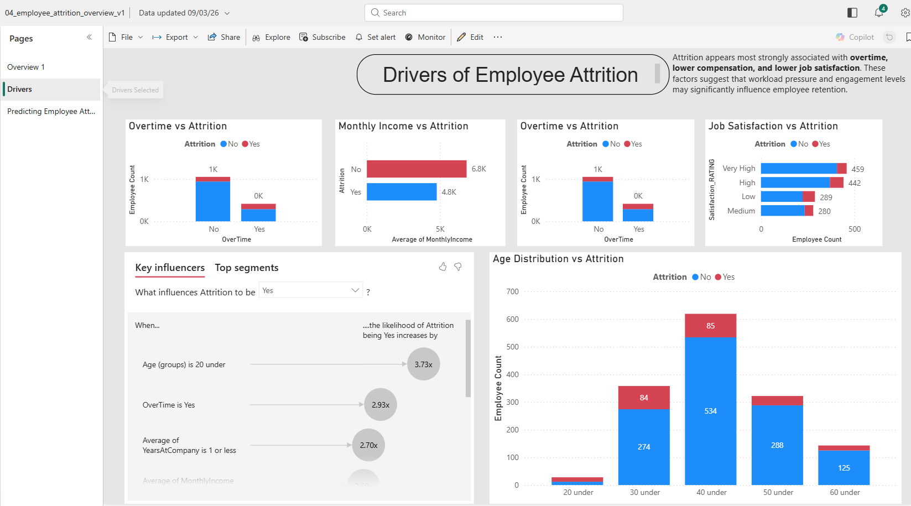
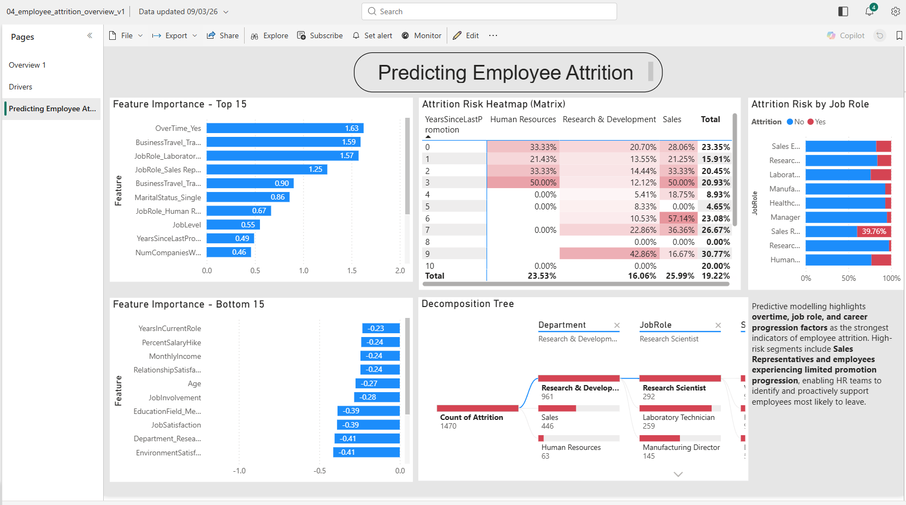
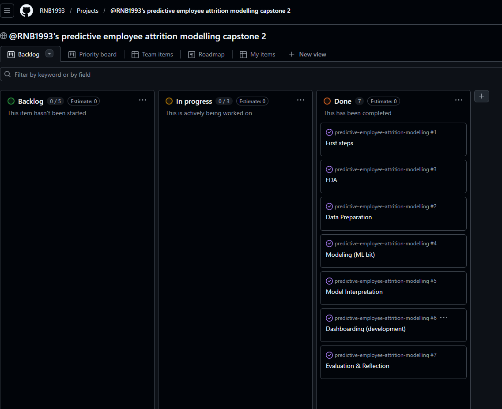

# Predictive Employee Attrition Modelling

**GitHub repository:** [https://github.com/RNB1993/predictive-employee-attrition-modelling](https://github.com/RNB1993/predictive-employee-attrition-modelling)

## Overview

This project analyses employee attrition data to identify the key factors associated with staff turnover and to build a machine learning model that predicts whether an employee is at risk of leaving the organisation. The project combines Python-based ETL and exploratory data analysis with an interactive MVP Power BI dashboard to communicate findings to non-technical stakeholders.

The goal is to support HR and business leaders with a more data-driven approach to retention by highlighting high-risk employee segments, surfacing the main drivers of attrition, and enabling more proactive interventions.

---

## Business Problem

Employee attrition can create significant costs for an organisation, including:

- increased recruitment and onboarding costs
- loss of organisational knowledge
- disruption to team productivity and morale
- reduced continuity within departments and job roles

In this project, the business challenge is to understand why employees leave and to develop a predictive solution that helps decision-makers identify attrition risk earlier.

---

## Project Aim

The main aim of this project is to investigate the drivers of employee attrition and develop a predictive analytics solution that supports retention planning.

The project objectives are to:

- clean and prepare the raw dataset for analysis
- explore patterns and relationships linked to attrition
- test business-led hypotheses through visual analysis
- build and evaluate classification models to predict attrition
- create an interactive Power BI dashboard for stakeholder use
- translate insights into practical HR recommendations

---

## Target Audience

This project is designed for:

- HR teams monitoring employee retention
- line managers interested in team stability and risk factors
- senior stakeholders who need a clear summary of attrition trends
- analysts who may want to extend the modelling approach in future

---

## Dataset

**Dataset used:** IBM HR Analytics Employee Attrition & Performance dataset  
**Source:** Kaggle – IBM HR Analytics Employee Attrition & Performance  
**Dataset link:** [https://www.kaggle.com/datasets/pavansubhasht/ibm-hr-analytics-attrition-dataset/](https://www.kaggle.com/datasets/pavansubhasht/ibm-hr-analytics-attrition-dataset/)  
**Format:** CSV  
**Target variable:** `Attrition`

The dataset contains employee-level demographic, compensation, satisfaction, performance, and work-pattern variables. These features make it suitable for both descriptive analytics and supervised machine learning classification.

---

## Ethics and Responsible Use

This project uses the publicly available **IBM HR Analytics Employee Attrition & Performance** dataset hosted on Kaggle for educational and portfolio purposes.

No personally identifying information was used in the analysis, and any unnecessary or potentially identifying fields were excluded where appropriate. The findings should be interpreted with care, as the dataset is a public sample and may not fully represent all organisations or employee populations.

The predictive model is intended as a decision-support tool only and should not be used as the sole basis for real-world HR decisions.

---

## Project Hypotheses

1. **Employees with lower monthly income are more likely to leave.**
2. **Employees who work overtime are more likely to leave.**
3. **Employees with lower job satisfaction have higher attrition.**
4. **Employees with longer periods since their last promotion are more likely to leave.**
5. **Employees with a larger commute distance are more likely to leave.**
6. **Employees with shorter tenure are more likely to leave.**

---

## Methodology

The project followed a structured analytics workflow:

### 1. ETL

The raw dataset was extracted into Python and transformed through a repeatable data-cleaning pipeline. Key tasks included:

- checking dataset shape and structure
- reviewing data types
- checking for missing values and duplicates
- removing unnecessary fields
- preparing categorical and numeric features for analysis
- saving a cleaned project version of the dataset for downstream notebooks and dashboard use

### 2. Exploratory Data Analysis

EDA was used to understand the dataset, investigate attrition patterns, and test the project hypotheses. This included:

- descriptive statistics
- target distribution analysis
- comparisons between attrition and key features
- distribution plots for numerical variables
- category-based visual analysis
- correlation analysis

### 3. Machine Learning

A supervised classification approach was used to predict attrition. Multiple models were tested and compared to assess which approach performed best for the problem.

**Tested models:**

- Logistic Regression
- Random Forest Classifier

**Evaluation metrics included:**

- Accuracy
- Precision
- Recall
- F1 Score
- ROC AUC

### 4. Dashboarding and Storytelling

Power BI was used to create an interactive minimum viable product (MVP) dashboard that presents the key findings, supports filtering, and enables stakeholders to explore attrition trends by department, role, income, tenure, satisfaction, and other relevant dimensions.

The dashboard was designed as a functional first release that demonstrates how business users could interact with attrition insights, while leaving room for future enhancement and expansion.

---

## Key Visualisations

The dashboard and notebooks include multiple visualisation types to answer business questions and support the hypotheses, including:

- bar charts
- stacked / grouped bar charts
- box plots
- histograms
- heatmaps
- KPI cards

These were selected to ensure the project demonstrates a range of visual techniques while keeping the analysis understandable for business users.

---

## Hypothesis Validation Summary

### Hypothesis 1: Lower income is associated with higher attrition

**Result:** Supported  
**Summary:** The visual analysis supports the hypothesis that lower compensation may be associated with higher attrition. This suggests that salary competitiveness may play an important role in employee retention, particularly for lower salary bands where attrition appears more concentrated.

### Hypothesis 2: Overtime is associated with higher attrition

**Result:** Supported  
**Summary:** Employees who work overtime show a noticeably higher attrition rate than those who do not. This suggests that workload pressure and possible burnout may be contributing to employee turnover.

### Hypothesis 3: Lower job satisfaction is associated with higher attrition

**Result:** Supported  
**Summary:** Employees reporting lower job satisfaction appear more likely to leave the organisation, while higher satisfaction levels show comparatively lower attrition. This indicates that employee engagement and workplace satisfaction are likely to be important retention factors.

### Hypothesis 4: Time since last promotion is associated with higher attrition

**Result:** Partially supported  
**Summary:** Employees who left the organisation appear to have waited longer for promotion than those who remained. The pattern suggests that limited career progression may contribute to attrition, although the relationship is not strong enough to treat it as a sole driver.

### Hypothesis 5: Larger commute distance is associated with higher attrition

**Result:** Not supported  
**Summary:** The analysis shows only a small difference in commute distance between employees who left and those who stayed. Commute distance may affect some individuals, but it does not appear to be a major attrition driver in this dataset.

### Hypothesis 6: Shorter tenure is associated with higher attrition

**Result:** Supported  
**Summary:** Attrition is more concentrated among employees with shorter tenure, suggesting that many employees leave during the earlier stages of employment. This highlights early-stage retention, onboarding, and employee support as important areas for improvement.

---

## Machine Learning Results

The machine learning stage focused on predicting whether an employee would leave the organisation.

### Model comparison

| Model | Accuracy | Precision | Recall | F1 Score | ROC AUC |
|---|---:|---:|---:|---:|---:|
| Logistic Regression | 0.755 | 0.356 | 0.660 | 0.463 | 0.803 |
| Random Forest | 0.844 | 0.571 | 0.085 | 0.148 | 0.783 |

### Best model

Although Random Forest achieved higher overall accuracy and precision, Logistic Regression was selected as the preferred model because it delivered substantially better recall for the attrition class.

In this project, identifying employees at risk of leaving was more important than maximising overall accuracy, because a model that fails to detect likely leavers would have limited business value. Logistic Regression correctly identified a much larger proportion of attrition cases, making it the more practical model for an HR retention use case.

### Interpretation

The comparison highlights the importance of evaluating models beyond accuracy alone. Random Forest performed well on the majority class and achieved strong overall accuracy, but its recall of 0.085 means it missed most employees who actually left.

Logistic Regression, while less accurate overall, achieved a recall of 0.660 and a stronger ROC AUC of 0.803, making it more effective at flagging potentially at-risk employees. From a business perspective, this makes Logistic Regression the better fit as an early warning support tool, even though it still produces false positives and should be used alongside human judgement rather than as a standalone decision system.

---

## Dashboard Summary

The Power BI dashboard was designed as a minimum viable product (MVP) to help stakeholders explore attrition through a clear narrative. The focus was on delivering a usable first version with meaningful KPIs, core interactive filtering, and business-relevant visuals rather than attempting to build a fully production-ready HR analytics solution in the first iteration.

### Dashboard features

- high-level KPI summary
- attrition breakdown by role, department, and overtime
- employee satisfaction and tenure analysis
- salary and demographic comparisons
- interactive slicers and filters
- clear visual commentary to support business interpretation
- MVP structure focused on core stakeholder needs

**Live dashboard:** [https://app.powerbi.com/links/XZsewo2AW1?ctid=c233c072-135b-431d-af59-35e05babf941&pbi_source=linkShare](https://app.powerbi.com/links/XZsewo2AW1?ctid=c233c072-135b-431d-af59-35e05babf941&pbi_source=linkShare)

### Dashboard Screenshot







### Dashboard pages

**Page 1 – Executive Overview**  
Provides a high-level summary of attrition rate, employee profile, and the most important business patterns.

**Page 2 – Attrition Drivers**  
Explores which features appear most strongly associated with turnover, including overtime, satisfaction, income, and tenure.

**Page 3 – Predictive Insights / Risk View**  
Summarises model performance and helps stakeholders understand which employee profiles may require attention.

---

## Business Recommendations

Based on the analysis, the following recommendations can be considered:

1. **Review overtime-heavy roles and teams** to reduce burnout-related attrition risk.
2. **Prioritise retention efforts for early-tenure employees**, especially during the first few years of employment.
3. **Investigate lower-paid employee groups** to assess whether salary competitiveness is contributing to turnover.
4. **Strengthen employee engagement and job satisfaction initiatives** through manager support, feedback mechanisms, and development opportunities.
5. **Review promotion pathways and progression visibility** to reduce frustration among employees who may feel stalled in their careers.
6. **Use the predictive model as a support tool** to help HR identify potentially at-risk employees for proactive review, rather than as a replacement for human decision-making.

---

## Project Structure

```text
predictive-employee-attrition-modelling/
│
├── README.md
├── requirements.txt
├── jupyter_notebooks/
│   ├── 01_ETL.ipynb
│   ├── 02_VIS.ipynb
│   └── 03_ML.ipynb
│
├── data/
│   ├── raw/
│   │   └── WA_Fn-UseC_-HR-Employee-Attrition.csv
│   └── processed/
│       ├── attrition_clean_v1.csv
│       └── logistic_regression_coefficients.csv
│
├── dashboard/
│   └── 04_employee_attrition_overview_v1.pbix
└── images/
    ├── powerbi-dashboard-overview.png
    ├── powerbi-dashboard-page-2.png
    ├── powerbi-dashboard-page-3.png
    └── github-projects-board.png

```

## Project Management and Workflow

Project delivery was tracked using a GitHub Projects board, which was used to organise tasks across backlog, in progress, and completed stages. This helped structure the work across ETL, EDA, machine learning, dashboarding, and reflection, while also providing a clear audit trail of how the project progressed over time.

Using the board supported a more disciplined workflow by breaking the capstone into manageable stages and making progress visible throughout the build. The live GitHub Projects board can be viewed here: [https://github.com/users/RNB1993/projects/3](https://github.com/users/RNB1993/projects/3).

**Project board screenshot:**  



---

## Technologies Used

### Programming and analysis

- Python
- Jupyter Notebook
- pandas
- NumPy
- matplotlib
- seaborn
- scikit-learn

### Dashboarding

- Power BI

### Version control and documentation

- Git
- GitHub
- Markdown

---

## How to Run the Project

1. Clone this repository and create a Python venv environment. 
2. Install the required dependencies from `requirements.txt`.
3. Open the notebooks in Jupyter Notebook or VS Code.
4. Run the ETL notebook first to generate the cleaned dataset.
5. Run the EDA and modelling notebooks.
6. Open the Power BI file to explore the dashboard.

Example installation command:

```bash
pip install -r requirements.txt
```

---

## Testing and Validation

The project was tested through:

- notebook execution from start to finish
- checks on cleaned dataset outputs
- comparison of model evaluation metrics
- validation of dashboard filters and interactions
- review of visual consistency and readability

### Known limitations

- the dataset is relatively small and may limit model generalisation
- class imbalance can affect recall for the attrition class
- the dataset is static and does not capture changes over time
- results indicate association, not guaranteed causation

---

## Reflection

This project strengthened my understanding of the full analytics lifecycle, from problem definition and ETL through to visual storytelling and machine learning.

A key learning point was that model evaluation requires more than simply choosing the highest accuracy. Because attrition is an imbalanced target, precision, recall, F1 score, and ROC AUC all needed to be considered before deciding which model was most appropriate.

The project also improved my ability to translate technical work into business-facing outputs. Building the Power BI dashboard required me to think not only about analysis quality, but also about layout, usability, accessibility, and how to communicate findings clearly to stakeholders.

Overall, this project has helped prepare me for real-world analytics work by combining Python, machine learning, business intelligence, and documentation into a single end-to-end workflow.

---

## Future Improvements

As the current dashboard is positioned as an MVP, there is clear scope for future iteration. Possible next steps for this project include:

- testing additional classification models
- tuning hyperparameters for improved recall
- adding explainability techniques such as feature importance or SHAP
- building a live input form for attrition risk scoring
- expanding the dashboard with scenario-based retention planning

---

### Content and inspiration

- Code Institute assessment guidance and project structure
- Public dataset provider: `pavansubhasht/ibm-hr-analytics-attrition-dataset/`

---

### Acknowledgements

- Bootcamp materials
+ Chapater: Advanced data analytics, Subsections: visualisation machine learning (Advanced ML methodologies using Python, Case studies of implementing AI/ML models in different industries)
- Walkthrough references 
+ [power bi heatmap guide](https://www.youngurbanproject.com/power-bi-heatmap/)
+ [Influncers guide on creation](https://learn.microsoft.com/en-us/power-bi/visuals/power-bi-visualization-influencers?tabs=powerbi-desktop))

---
## Use of AI Tools
AI-assisted tools were used to support hypothesis development,
code refinement (Microsoft copilot), and narrative clarity (Grammarly premium).
All AI-assisted suggestions were reviewed and validated
against the dataset prior to inclusion.

---

## Disclaimer

This project was created for educational purposes as part of the Code Institute Advanced Data Analytics, Visualisation and Machine Learning bootcamp portfolio submission (number 2).